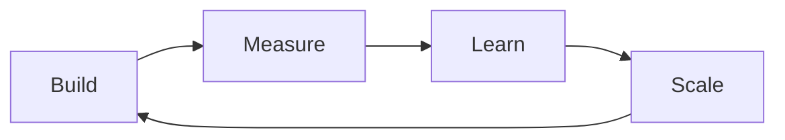

# Key Concepts

Lean transformation combines proven change management principles with modern agile practices to drive sustainable organizational change. This page introduces the core concepts that underpin our methodology.

## Three Core Systems

At the heart of lean transformation are three interconnected systems:

<CardGroup cols={3}>
  <Card title="Production Systems" icon="gears">
    Develop value-focused products through MVPs and rapid iteration
  </Card>
  <Card title="Culture Systems" icon="people">
    Build data-driven capabilities across your organization
  </Card>
  <Card title="Program Systems" icon="chart-network">
    Coordinate and scale transformation efforts
  </Card>
</CardGroup>

## Think Big, Start Small, Scale Fast

Our methodology is built around three key phases:

<Steps>
  <Step title="Think Big">
    Set an ambitious vision and identify transformative opportunities
  </Step>
  <Step title="Start Small">
    Begin with MVPs that demonstrate value quickly
  </Step>
  <Step title="Scale Fast">
    Use systematic processes to rapidly expand successful initiatives
  </Step>
</Steps>

## Value-Driven Approach

Every transformation initiative should be grounded in measurable value:

- **Value Assessment** - Rigorous evaluation of potential benefits
- **Value Measurement** - Clear metrics for tracking progress
- **Value Realization** - Systematic processes for delivering outcomes

## The Transformation Cycle

## Core Principles

<CardGroup cols={2}>
  <Card title="Value Focus" icon="bullseye">
    Every initiative should deliver measurable value
  </Card>
  <Card title="Systematic Approach" icon="diagram-project">
    Use repeatable processes over one-off efforts
  </Card>
  <Card title="Cross-Functional" icon="users-between-lines">
    Break silos through collaborative transformation
  </Card>
  <Card title="Evidence-Based" icon="chart-line">
    Make decisions based on data and measured outcomes
  </Card>
</CardGroup>

## Getting Started

Success in lean transformation comes from:

1. Building the right systems
2. Starting with clear value measures
3. Using systematic processes
4. Celebrating progress
5. Scaling what works

<Note>
  Remember: You don't rise to the level of your goals - you fall to the level of your systems.
</Note>

## Next Steps

- Read about our [Production Systems](/production-systems/value-assessment) approach
- Learn how to [measure value](/frameworks/value/measurement-framework)
- Explore our [implementation guide](/implementation/getting-started)